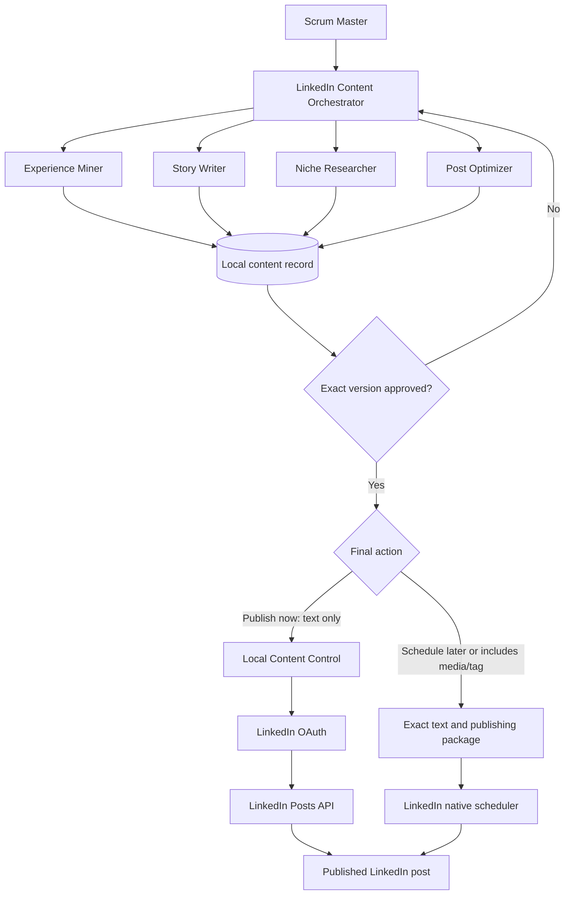

# LinkedIn Content Workflow Architecture

## Decision Rules

- The official API path publishes an already-approved **text-only** post immediately after a separate confirmation.
- For a post scheduled later, or one containing an image, video, document, or native company tag, use LinkedIn's native scheduler with the supplied publishing package.
- Manual LinkedIn scheduling continues when the local computer and control panel are off.
- A changed final post, attachment package, or tag request requires fresh approval.
- Playwright is reserved for local control-panel validation and never automates LinkedIn account actions.